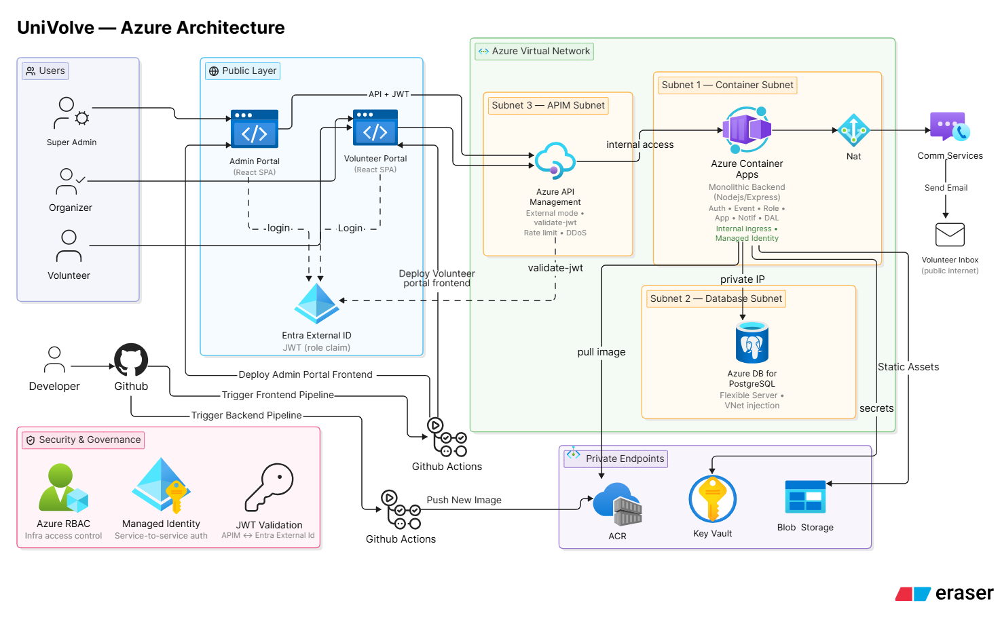

# UniVolve - University Volunteering & Event Management System 

## System Design On Azure Architecture 

## Folder Structure 

- `local/`  — Dockerized local dev: React + Express + Postgres + MailHog. `docker compose up --build`.
- `azure/`  — Production variant: Azure AD B2C (MSAL), API Management, Container Apps,
  PostgreSQL Flexible Server (private VNet), Key Vault + Managed Identity,
  Azure Communication Services email, Static Web Apps, plus full Terraform IaC and GitHub Actions CI/CD.
